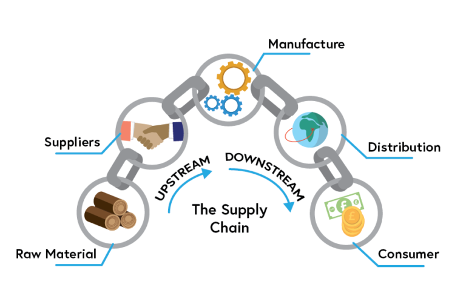

<p align="center">
  
</p>

<h1 align="center">TraceRx</h1>

<p align="center">
  <i>Blockchain-powered, end-to-end tracking of pharmaceutical batches — simple roles, explicit stage gates, and clear UI feedback.</i>
</p>

---

## 🚀 Technology Stack

<p align="center">
  
  
  
  
  
  
  
  
  
</p>

---

## 📜 Description

**What It Is:** TraceRx is a **blockchain-based supply chain system** for pharma batches.

**What It Does:** Every handoff — from **Raw Material Supplier → Manufacturer → Distributor → Retailer → Sold** — is recorded on-chain.

**What That Means:** fewer manual reconciliations, **tamper-evident** history, and a single verifiable source of truth for all participants.

---

## 🎯 Core Features

- **Role registries** (Owner, RMS, MAN, DIS, RET) with access control.
- **Stage-gated lifecycle** (`Init → RawMaterialSupply → Manufacture → Distribution → Retail → Sold`).
- **Readable errors** in the UI mirroring contract revert reasons.
- **React SPA** with MetaMask integration and straightforward UX.

---

## 🏗 Architecture (at a glance)

<table>
<tr>
<td width="75%"></td>
<td width="45%">

**How it fits together**  

- **Smart Contract (Solidity)**: Owns the truth. Stores role registries and `MedicineStock` with current stage. Enforces who can do what, when.  
- **Web3/MetaMask**: The bridge. Signs transactions and connects the React app to your Ethereum node (local Ganache/Hardhat or a testnet).  
- **React Client**: Clean pages for role registration, batch creation, stage progression, and tracking. Reads ABI + address from `client/src/artifacts/PharmaSupplyChain.json`.  
- **Truffle**: Compile/deploy tooling. Produces JSON artifacts used by the client.

</td>
</tr>
</table>

---

## 🔄 Supply Chain Flow (business view)

<table>
<tr>
<td width="55%"></td>
<td width="45%">

**Stages & Who Acts**  

1. **Init** — Batch is created by **Owner**.  
2. **Raw Material Supply** — Set by **RMS** via `RMSsupply(id)`.  
3. **Manufacture** — Set by **MAN** via `Manufacturing(id)`.  
4. **Distribution** — Set by **DIS** via `Distribute(id)`.  
5. **Retail** — Set by **RET** via `Retail(id)`.  
6. **Sold** — Finalize by **assigned RET** via `sold(id)`.  

Each step checks the caller’s role and the current stage before moving forward.

</td>
</tr>
</table>

---

## 🧩 Methodology — Running TraceRx Locally

Follow these steps exactly to run **TraceRx** on your machine.

### 1️⃣ Requirements

- **Node.js** (LTS recommended) + **npm**
- **Truffle**: `npm install -g truffle`
- **Ganache** (GUI or CLI) **OR** Hardhat for local blockchain
- **MetaMask** browser extension
- Git (recommended)

---

### 2️⃣ Clone the Repository

```bash
git clone https://github.com/AbdurRafey237/TraceRx.git
cd TraceRx
```

---

### 3️⃣ Install Dependencies

```bash
npm install
cd client
npm install
cd ..
```

---

### 4️⃣ Start Local Blockchain

Using **Ganache**:
1. Open Ganache GUI or run `ganache-cli --chainId 1337`.
2. Make sure MetaMask is connected to `http://127.0.0.1:7545` or `8545`.

Using **Hardhat**:
```bash
npx hardhat node
```

---

### 5️⃣ Deploy Contracts

```bash
truffle compile
truffle migrate
```

---

### 6️⃣ Run the Frontend

```bash
cd client
npm i
npm install -save web3
npm
npm start
```

Visit: `http://localhost:3000`

---

### 7️⃣ Connect MetaMask

- Import one of the Ganache accounts into MetaMask.
- Switch to the same network (localhost).
- Interact with the dApp.

---

## 📌 Pro Tips

- Always clear browser cache after redeploying contracts.
- Use `.env` for sensitive configs.
- For testnet deployment, update `truffle-config.js` with Infura/Alchemy RPC and private key.

---

## 📄 License

MIT License — free to use, modify, and distribute.
