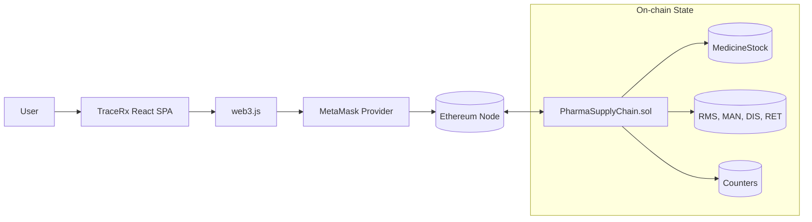
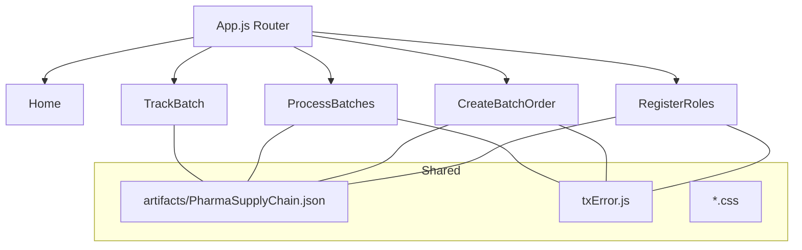

# TraceRx

TraceRx is a minimal end-to-end pharma supply chain demo that records batch orders and role-based handoffs on Ethereum. It focuses on clarity: simple roles, explicit stage transitions, and UI feedback that mirrors on-chain rules.

---

## What’s inside

- **Smart contract:** `PharmaSupplyChain.sol` (single owner; role registries; stage-gated batch flow)
- **Frontend:** React (Create React App), React Router (v5), Web3.js, MetaMask
- **Tooling:** Truffle for compile/deploy; JSON artifacts consumed by the client

---

## Core concepts

### Roles
- **Owner (admin):** the deployer; can add roles and create batch orders.
- **RMS / Manufacturer / Distributor / Retailer:** accounts registered by the owner.
  - Each step can be executed only by the corresponding registered role.

### Batch lifecycle (stages)
`Init → RawMaterialSupply → Manufacture → Distribution → Retail → sold`

Transitions:
- `RMSsupply(id)` from `Init`
- `Manufacturing(id)` from `RawMaterialSupply`
- `Distribute(id)` from `Manufacture`
- `Retail(id)` from `Distribution`
- `sold(id)` only by the **assigned Retailer** from `Retail`

### On-chain data model (simplified)
- `MedicineStock[id]` → `{ id, name, description, RMSid, MANid, DISid, RETid, stage }`
- Role registries: `RMS`, `MAN`, `DIS`, `RET` (each stores `{ addr, id, name, place }`)
- Counters: `medicineCtr`, `rmsCtr`, `manCtr`, `disCtr`, `retCtr`

---

## App structure (client)

- **Home** — entry screen, connect/status, quick actions
- **RegisterRoles** — owner registers RMS/MAN/DIS/RET
- **CreateBatchOrder** — owner creates medicine batch orders
- **ProcessBatches** — role actions to advance stage (RMS → MAN → DIS → RET → Sold)
- **TrackBatch** — read-only tracking / status table

Shared utilities:
- `src/artifacts/PharmaSupplyChain.json` — ABI + deployed address per network id
- `src/txError.js` — extracts revert messages and shows friendly alerts
- Global Web3 setup enables `web3.eth.handleRevert = true` for readable errors

---

## Diagrams

### System / Data Flow


### Frontend modules


---

## Getting started

### 1) Prerequisites
- Node.js (LTS)
- Truffle
- A local Ethereum node (e.g., Ganache/Hardhat) or a testnet RPC
- MetaMask in the browser

### 2) Install dependencies
From the project root:
```bash
npm install
```
Client app:
```bash
cd client
npm install
```

### 3) Compile & deploy the contract
From the project root:
```bash
truffle compile
truffle migrate --reset
```
> Tip: In `truffle-config.js`, using `network_id: "*"` for a local network avoids 5777/1337 mismatches.

After deploy, ensure the generated `build/contracts/PharmaSupplyChain.json` is available to the client (copy or point) as:
```
client/src/artifacts/PharmaSupplyChain.json
```

### 4) Run the client
```bash
cd client
npm start
```
Open the app in a browser and connect MetaMask to the same network used in step 3.

---

## Using the app (happy path)

1. **Connect wallet** (the app attempts silent connect, then prompts).
2. **Register roles** (Owner only): add at least one RMS, Manufacturer, Distributor, Retailer.
3. **Create batch order** (Owner only): set batch name/notes; stage becomes `Init`.
4. **Process batches**:
   - RMS calls `RMSsupply` (Init → RawMaterialSupply)
   - MAN calls `Manufacturing` (→ Manufacture)
   - DIS calls `Distribute` (→ Distribution)
   - RET calls `Retail` (→ Retail)
   - Assigned RET calls `sold` (→ sold)
5. **Track**: view batches and their current stage.

---

## Error messages (what you’ll see)

- Contract reverts surface directly (e.g., **“Owner only.”**, **“Caller not a registered manufacturer.”**, **“Batch not at manufacturing stage.”**).
- User cancels in MetaMask → **“Transaction rejected in MetaMask.”**
- Input guards catch obvious issues (e.g., non-numeric batch ID).

This is powered by `web3.eth.handleRevert = true`, a preflight `.call()` before `.send()`, and `txError.js` to extract revert reasons.

---

## Network switching tips

- If you change chain/network, **re-deploy** and make sure the client’s artifact JSON contains an entry for that **network id**. The UI looks up:
  ```
  SupplyChainABI.networks[networkId].address
  ```
- If you see **“The smart contract is not deployed to the current network”**, you’re on a different network id than the artifact contains—migrate again and restart the client.

---

## Troubleshooting

- **MetaMask shows “Internal JSON-RPC error”**  
  Your revert reason is nested; the client’s `txError.js` will unwrap it.

- **Owner-only actions fail**  
  Confirm the connected account equals the contract’s `Owner`.

- **Role step fails**  
  Ensure the connected wallet is registered for that role and the batch is at the previous stage.

- **Title/manifest issues**  
  The app title comes from `public/index.html`. If installed as a PWA, the window title may combine the manifest `name` and the document title. Clear site data or reinstall the app if cached.

---

## Project layout (reference)

```
contracts/
  PharmaSupplyChain.sol
  Migrations.sol
migrations/
  1_initial_migration.js
  2_deploy_contracts.js
client/
  public/
    index.html
    manifest.json
    favicon / icons
  src/
    App.js
    Home.js
    RegisterRoles.js
    CreateBatchOrder.js
    ProcessBatches.js
    TrackBatch.js
    txError.js
    artifacts/
      PharmaSupplyChain.json
    styles/*.css
truffle-config.js
```

---
